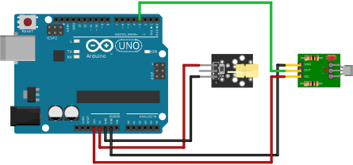

# Arduino Shutter Speed Tester

This small project allows you to use an Arduino to test the shutter speeds on just about every analog film camera.

As film cameras age, their shutter speeds may drift, mostly due to old grease in the shutter mechanism. Using an Arduino is a quick yet precise way of measuring the shutter speeds of your camera in order to determine whether the mechanism requires cleaning or even adjusting.

When you measure the shutter speeds on your camera, do keep in mind that old camera shutters are only so precise. Try to find the specifications of your camera/shutter before assuming that it needs fixing. The _Compur-Rapid_ shutter on my _Valter Voss Diax_ camera is only accurate to about 15-20% according to the specifications. Keep that in mind when your shutter speeds are not perfectly on point.

## Get Going

To build your shutter speed tester, you will need a laser emitter module and a laser detector module. You should be able to find these very cheaply anywhere that sells Arduino accessories. Connect them to your Arduino as shown.

Upload the Sketch and place your film camera in between the emitter and the detector. You will have to be in a reasonbly dark environment, such that the detector is not set off by ambient light. Use bulb mode on your camera to make sure that the laser hits the detector through the shutter. The Arduino's on-board LED will turn on whenever the detector is triggered. On SLR cameras it is recomended to remove the lens, but the shutter speed tester will work correctly through a lens as well.

To take a reading, once set up, open the Serial Monitor of the _Arduino IDE_, set a shutter speed on your camera, and fire away. The Serial Monitor should show the shutter speed measured by the Arduino tester both in 1/x seconds as well as in microseconds.

On focal-plane shutters it is good practice to measure multiple different positions of the frame, as the shutter curtains on a bad shutter might travel at different speeds. On leaf shutters it is best to measure the center of the frame. You might want to take multiple readings as the shutter speeds might fluctuate.